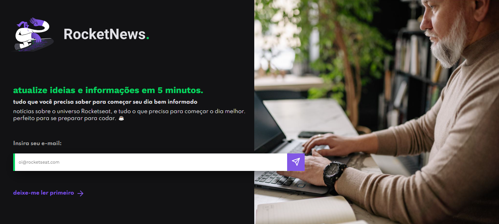

## 💻 Projeto

Desafio do Discover da Rocketseat onde consistiu em desenvolver uma página web simples utilizando HTML e CSS que servirá no futuro para captação de leads ou inscrição em newsletter.

## 🚀 Tecnologias

<ul>
  <li>HTML</li>
  <li>CSS</li>
</ul>

## 🔖 Layout do Projeto

O layout pode ser visto através do Figma

[Layout Web](https://www.figma.com/file/cXWelYowBwrYdp31GfWQmZ/DD-%2F-RocketNews-(Copy)?node-id=3%3A2&t=Ggq1hROdeeQU5Urk-0)
